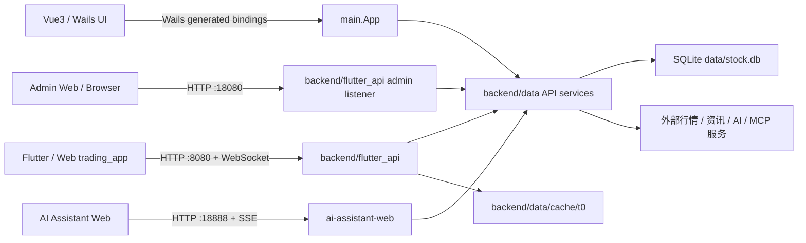

# go-stock 项目文档

> 文档快照：2026-08-21。本文档描述仓库当前代码，而不是只复述 README；当实现与旧文档不一致时，以代码和对应测试为准。

## 1. 项目定位

go-stock 是一个以本地桌面端为主、同时提供 Web/Flutter 行情服务和 AI 助手 Web 服务的股票研究工具。它把 A 股、港股、美股行情，基金数据，资讯/研报，资金流向，选股，AI 分析与定时监控组合在同一个本地 SQLite 数据目录中。

项目的产品边界是“分析与辅助决策”，不是交易执行系统：行情和资讯来自网络，AI 输出具有不确定性，不能替代投资判断。

## 2. 运行形态与入口

仓库当前有三条主要运行形态；其中 Flutter/Web 服务进程包含用户和管理两个独立监听器。它们共享 `backend/data`、`backend/models`、`backend/db` 和 `data/stock.db`，但面向的客户端不同。

| 形态 | 入口 | 默认地址/产物 | 主要职责 |
| --- | --- | --- | --- |
| Wails 桌面端 | `main.go` | 内嵌 `frontend/dist` | Vue3 桌面 UI、Wails 绑定、行情监控、AI 分析、配置和研究中心 |
| Flutter/Web 行情服务 | `cmd/server/main.go` → `backend/flutter_api.Start` | 用户监听 `:8080`；可托管 `trading_app/build/web` | Flutter 用户 REST、WebSocket、T0 选股、短线情绪、新闻/异动/策略接口 |
| 模块权限管理后台 | 与 Flutter/Web 服务同一 `backend/flutter_api.Start` | 管理监听默认 `:18080`，由 `GO_STOCK_ADMIN_ADDR` 覆盖；可托管 `admin-web/dist` | 数据库管理员登录、用户状态和模块权限管理、管理 SPA |
| AI Assistant Web | `ai-assistant-web/cmd/ai-assistant-web/main.go` | `:18888`，可用 `AI_ASSISTANT_WEB_ADDR` 覆盖 | 独立 AI 助手页面、SSE 流式对话、会话、分享；VIP2 校验 |

Wails 主进程默认同时启动 AI Assistant Web 和 `StartHTTPServer()`；后者在同一个 Go 进程中启动 8080 用户监听器和独立的 18080 管理监听器。如果只开发 Flutter API 或管理后台，可以直接运行 `go run ./cmd/server`，不需要启动 Wails。



## 3. 技术栈

- 桌面壳：Go 1.26 module + Wails v2；平台文件为 `app_darwin.go`、`app_windows.go`、`app_linux.go`。
- 桌面前端：Vue 3、Vite、Vue Router、Naive UI；图表使用 ECharts、Lightweight Charts；Markdown 使用 `md-editor-v3`。
- 移动/Web 前端：Flutter/Dart，代码位于 `trading_app/`，网络层使用 Dio，采用 feature/data/domain/presentation 分层。
- 数据库：SQLite + GORM，默认连接 `data/stock.db`，启用 WAL、busy timeout 和有限连接池。
- AI：`cloudwego/eino`，同时兼容多个 OpenAI 风格服务、本地模型和其他适配器；AI 工具、MCP 工具、Skill 在运行时组合。
- 网络与抓取：Resty、Chromedp、GoQuery、通达信/东财/新浪等数据适配器；部分来源依赖 Cookie、浏览器或 API Key。
- 调度与缓存：`robfig/cron` 管理应用任务，`freecache` 做进程内去重/冷却，T0 另有文件缓存和归档。

## 4. 仓库结构

```text
.
├── main.go / app*.go       Wails 应用生命周期、绑定方法、平台适配、后台监控
├── app_common.go            Wails 暴露给前端的跨功能方法
├── backend/
│   ├── data/                外部数据源适配器、领域服务、AI 数据工具、业务查询
│   ├── models/              GORM 模型、分页响应、跨模块数据结构
│   ├── db/                  SQLite/GORM 初始化和会话存储
│   ├── agent/               React/PlanExecute Agent、记忆、定时任务、工具分组
│   ├── flutter_api/         :8080 用户 REST/WebSocket、:18080 管理 API/SPA、T0、短线情绪、社区策略
│   ├── logger/              日志封装
│   └── util/                HTML/结构体 Markdown 等通用转换
├── frontend/src/            Vue 页面和组件
├── frontend/wailsjs/        Wails 自动生成的 Go 调用绑定；不要手工修改
├── trading_app/             Flutter 客户端及其 Web 构建产物
├── ai-assistant-web/        独立 AI 助手的 Go 服务和 Vue 静态页面
├── cmd/server/              启动 :8080 用户服务和独立 :18080 管理服务
├── cmd/backfill_ai/         为已有重要新闻补充 AI 意见的一次性工具
├── scripts/                 构建、启动、Flutter API 保活、短线研究脚本
├── docs/                    用户手册、功能说明、设计稿和计划
├── build/                   内嵌基础数据、图标、截图和打包资源
└── data/                    运行时 SQLite、字典、上传文件和本地数据
```

## 5. 启动与生命周期

### 5.1 Wails 桌面端

`main()` 的顺序是：

1. 创建 `data/`，初始化机器标识、赞助解密密钥和 SQLite。
2. 初始化情感分析数据，异步执行全局 `AutoMigrate()`。
3. 构造 `App`：创建 512 KiB `freecache`、秒级 cron、AI 工具集合和预警状态。
4. 启动 AI Assistant Web 与 `StartHTTPServer()`；后者在同一进程启动 `:8080` Flutter 用户服务和独立的管理服务（默认 `:18080`）。
5. 通过 `wails.Run` 加载内嵌前端，把 `App` 绑定给 Vue。

平台启动回调会设置 `a.ctx`、加载设置、注册前端错误事件、启动已启用的定时任务和交易日预缓存。`domReady` 后启动行情/资讯/基金/AI 推荐/自选股监控；关闭时保存窗口大小，并在 macOS、Windows、Linux 上执行各自的关闭确认和托盘/通知逻辑。

### 5.2 Flutter/Web API

`cmd/server` 初始化 SQLite、情感分析和 Flutter API 所需表后进入 `backend/flutter_api.Start()`。该服务：

- 在 `:8080` 注册 Flutter 用户 REST 路由和 `/ws` WebSocket；该监听器不注册 `/api/admin/`。
- 可通过 `GO_STOCK_WEB_DIR` 指定 Flutter Web 静态目录，否则寻找项目根下的 `trading_app/build/web`。
- 每 60 秒抓取财联社/新浪新闻。
- 交易时间内保存异动数据和市场统计快照。
- 交易日早盘前主动预热 T0 日线；收盘后刷新归档里的真实收盘涨幅。

### 5.3 模块权限管理后台

`backend/flutter_api.Start()` 会在同一 Go 进程中额外启动独立的管理监听器。两个监听器的职责边界如下：

- 用户监听固定为 `:8080`，提供 Flutter 用户 API、用户 Web 静态文件和 WebSocket；管理 API 不会暴露在 8080。
- 管理监听由 `GO_STOCK_ADMIN_ADDR` 控制，未设置时默认为 `:18080`。它提供 `/api/admin/` 管理 API；存在管理网页构建产物时，根路径 `/` 同时提供管理 SPA 和前端路由回退。
- 管理网页目录优先取 `GO_STOCK_ADMIN_WEB_DIR`；未设置时从项目根下的 `admin-web/dist` 查找包含 `index.html` 的目录。找不到构建产物时，管理 API 仍可用，可由单独运行的 Vite 开发服务器提供网页。
- `GO_STOCK_ADMIN_DEV_ORIGINS` 是开发期来源白名单，值为逗号分隔的完整 Origin，例如 `http://localhost:5174`。它用于 Vite 与管理 API 的开发期跨源请求/写操作校验；生产环境应使用管理网页与 API 同源访问，不应配置通配来源。

管理员不是硬编码账号。首次部署在项目根目录执行 `admin-init`，命令会隐藏读取并确认密码两次，在同一个 `users` 表中创建 `role=admin`、有效状态的数据库管理员，密码只保存为 bcrypt 哈希；不会写入明文密码或哈希，也不会回退到 `admin/admin`。账号沿用 `users.phone` 作为登录标识，重复账号会失败且不会覆盖已有密码。

管理网页的最小启动与 smoke flow（需先准备 `admin-web/dist/index.html`，或通过 `GO_STOCK_ADMIN_WEB_DIR` 指向等价目录）如下：

```text
go run ./cmd/admin-init -account 13900000000 -nickname 管理员
GO_STOCK_ADMIN_ADDR=:18080 go run ./cmd/server
浏览器打开 http://服务器地址:18080/
```

在管理网页使用刚创建的账号和密码登录；同时验证普通用户通过 `http://服务器地址:8080/` 或 8080 用户 API 登录。普通用户在尚未授权任何受控模块时，`GET /api/auth/modules` 应只有以下三个公开模块：`radar.monitored`（监控股票/自选）、`radar.watch_changes`（自选异动）和 `radar.all_changes`（全市场）。之后在 18080 管理后台授权受控模块，再重新加载用户端确认授权生效。

当前两个监听器由标准 HTTP 提供服务，非标准端口不是安全措施。正式公网部署前必须使用 HTTPS 反向代理或等价的传输保护：不要直接把 8080/18080 暴露到公网，代理应分别转发用户服务与管理服务、保留正确的 Host/Origin，并为用户 WebSocket 配置升级转发。管理会话 Cookie 的 `Secure` 属性按 Go 请求是否为 TLS 设置；若代理在外部终止 TLS，必须确保上游连接/应用的 HTTPS 感知方式已按受信任的代理边界配置，不能仅凭未验证的转发头宣称安全。

### 5.4 AI Assistant Web

服务内嵌 `ai-assistant-web/static`，提供 `/api/health`、`/api/vip-status`、`/api/ai-configs`、`/api/prompts`、`/api/session`、`/api/chat/summary-stream` 和 `/api/share`。AI 对话使用 Server-Sent Events，`EnableTools` 打开时复用 `data.Tools`。

## 6. 桌面端功能地图

路由定义在 `frontend/src/router/router.js`，导航菜单在 `frontend/src/App.vue`。主要页面如下：

| 页面/组件 | 业务范围 |
| --- | --- |
| `stock.vue` | 自选股、分组、实时价格、分时/日 K、多周期 K 线、盘口、资金趋势、AI 分析、价位预警、弹幕 |
| `market.vue` | 市场快讯、全球股指、重大指数、行业排名、个股/板块资金、龙虎榜、研报、公告、行业研究、热点 |
| `fund.vue` | 基金自选、基金排行、净值历史、K 线、前十大持仓 |
| `agent-chat.vue` | AI 智能体对话；复杂度自动判断 React 或 PlanExecute |
| `researchIndex.vue` | AI 报告、AI 推荐记录、异动监控、涨停梯队、提示词、选股、定时任务、交易日志、MCP、Skill |
| `settings.vue` | 通用、通知、浏览器、数据源、AI 模型、提示词广场等配置 |
| `FloatingAiAssistant.vue` / `FloatingAgentAssistant.vue` | 全局浮动 AI 入口和会话面板 |
| `kline-analysis.vue` | 多周期 K 线和技术指标分析 |

Wails 方法由 `frontend/wailsjs/go/main/App.js` 提供，前端通常直接调用 `main.App` 的导出方法；Go 侧的薄入口集中在 `app.go`、`app_common.go`，真正的数据抓取和业务逻辑大多在 `backend/data`。

## 7. 后端分层与数据流

### 7.1 `main.App` 是适配层，不是唯一业务层

`App` 负责把桌面生命周期、Wails 事件、文件对话框、系统通知、后台任务和业务服务接起来。典型调用链是：

```text
Vue component
  → wailsjs/go/main/App.js
  → main.App method
  → backend/data service / backend/agent
  → external provider or SQLite
  → Wails event / return value
```

实时价格和新闻刷新通常通过 Wails `EventsEmit` 推给前端；Flutter/Web 客户端则通过 JSON REST 和 WebSocket 获取同类数据。AI 桌面分析使用 `newChatStream` 事件，Agent 使用 `agent-message` 事件。

### 7.2 数据服务族

`backend/data` 按数据能力拆分，而不是严格的一文件一聚合：

- 股票基础资料、实时行情、自选、分组、K 线、分时、盘口、通达信 F10：`stock_data_api.go`、`stock_group_api.go`、`tdx_kline_api.go`。
- 东财/新浪/腾讯/通达信行情和资金：`eastmoney_*`、`sina_kline_api.go`、`fund_*`、`bk_fund_flow_api.go`。
- 资讯/研报/公告/热点/日历：`market_news_api.go`、`tool_*news*`、`eastmoney_api.go`、`wallstreetcn_api.go`。
- AI 分析、报告、推荐、提示词：`openai*.go`、`ai_*_api.go`、`prompt_template_api.go`。
- 通知与平台能力：`dingding_api.go`、`alert_*_api.go`、`sponsor_vip.go`、`mcp_server_api.go`。

同一类数据可能有多个来源。K 线常用 `GetStockKLineWithFallback` / `GetStockKLinePageWithFallback`，策略代码也明确采用“东财 → 新浪 → 腾讯 → 通达信”的降级思路。新增数据源时应优先放在 `backend/data`，不要把抓取代码塞进 Vue 或 HTTP handler。

### 7.3 SQLite 与自动迁移

数据库默认是 `data/stock.db`，使用 WAL、10 秒 busy timeout、最多 5 个打开连接。`db.Init` 会自动迁移基础表，Wails 的 `main.AutoMigrate` 继续迁移 AI、资讯、推荐、计划任务、交易记录、MCP、Skill 等表；Flutter API 另外迁移社区策略、市场统计和基础股票表。

重要持久化概念包括：

| 数据 | 典型模型/表 | 说明 |
| --- | --- | --- |
| 股票主数据 | `StockBasic`、`StockInfoHK`、`StockInfoUS` | 内置 JSON 初始化，设置开启时可更新 |
| 自选与分组 | `FollowedStock`、`Group`、`GroupStock` | 自选股是本地关注关系，不等同于股票主数据 |
| AI | `AIConfig`、`AIResponseResult`、`AiRecommendStocks`、`PromptTemplate` | 配置、分析报告、推荐记录和提示词分别存储 |
| 资讯 | `Telegraph`、`TelegraphTags`、`StockChangeHistory` | 新闻去重、标签、异动历史和统计 |
| 运行任务 | `CronTask` | cron 表达式、任务类型、运行状态和执行结果 |
| 研究辅助 | `TradingRecord`、`MarketStatistic`、`CustomStrategy` | 交易日志、盘中市场快照、自定义策略 |
| AI 扩展 | `MCPServer`、`MCPServerTool`、`Skill` | 外部工具连接、工具清单和问题触发技能 |
| 社区策略 | `StrategyUser`、`StrategyPost`、`StrategyComment`、`StrategyLike`、积分表 | 由 Flutter API 提供社区化策略/问答能力 |

SQLite 是本地单机数据源，代码中没有独立的迁移版本目录；模型调整主要依赖 GORM `AutoMigrate` 或显式 SQL 迁移。因此修改模型时要考虑已有用户的旧 `data/stock.db`，并同时补测试。

## 8. AI、工具、MCP 与 Skill

### 8.1 普通 AI 分析

股票卡片和市场摘要通过 `backend/data/openai*.go` 调用用户配置的 AI 服务。用户可选择系统 Prompt、用户 Prompt、思考模式和是否启用工具；结果可保存为 `AIResponseResult`，并导出 Markdown/Word/图片或分享到外部服务。

### 8.2 AI Agent

`backend/agent` 使用 Eino 构建 `StockAiAgent`：

- React：适合单轮、明确的查询，边调用工具边生成答案。
- PlanExecute：Planner → Executor → Replanner，适合组合分析；代码对迭代次数和中间结果做限制/压缩。
- 自动模式：通过问题复杂度和关键词判断使用哪种模式。
- 记忆：`ChatMemoryService` 按 session 保存用户/助手消息，浮动助手可选择记忆轮数。
- 流式：Agent 消息经 `agent-message` 事件发送到 Vue，包含执行步骤、工具调用和最终文本。

内置数据工具在 `backend/data/tools.go`，按基础、股票分析、市场、选股、资金流、新闻研究、AI 分析、运营等组分类；`backend/agent/tools/tool_groups.go` 根据问题关键词缩小工具集合，减少无关工具进入上下文。

### 8.3 MCP 与 Skill

MCP 服务由 `MCPServer` 持久化，支持 SSE/HTTP 类型连接。测试连接时会初始化 MCP client 并读取工具列表；启用后 Agent 运行时动态加载这些工具。

Skill 是可配置的领域提示词：它有名称、分类、触发关键词、系统提示词、示例对话、启用状态及绑定 MCP 服务。匹配用户问题后，Skill 提示词和相关工具进入 Agent 上下文。新增 Skill 相关功能时，优先保持“配置 → 触发匹配 → Prompt/工具注入”这条链路清晰。

## 9. T0 选股与短线情绪

这部分是独立于 Wails Vue 主页面的 Flutter/Web 业务，核心代码在 `backend/flutter_api`，客户端代码在 `trading_app/lib/features`。

### 9.1 T0 开盘日线选股

`t0_selection.go` 的策略输入是新浪股票池、日线 K 线和 T0 实时/竞价行情。主要过滤链为：主板股票、流通/总市值 50～9000 亿、近 7 个交易日涨停记忆或昨日破板、昨日成交额至少 5 亿、竞价涨幅约 0.01%～3%；MA20 过滤函数保留，但当前并非实际入选条件。

核心状态和文件是：

- `idle` / `warming` / `ready` / `failed`：按交易日维护的预热状态。
- 日线缓存：`backend/data/cache/t0/daily/t0_daily_cache_<date>.gob`。
- 选股归档：`backend/data/cache/t0/selection/t0_selection_<date>.json`。
- `GO_STOCK_CACHE_DIR` 可覆盖缓存根目录；若无法从工作目录/可执行文件路径定位项目根，服务会明确报错。

接口为 `GET /api/t0-selection`：`prewarm=1` 预热，默认参数在 09:25 前自动进入预热，`archived=1` 读取归档，`refresh_tags=1` 补算前日标记，`refresh_close=1` 强制刷新收盘涨幅，`list_dates=1` 列出归档日期。收盘刷新具有幂等标记，避免反复覆盖。

### 9.2 短线情绪

`short_term_emotion.go` 将市场统计快照、涨跌停/炸板、异动数据、量能和热点归一化为评分、阶段、动作、风险信号、盘中趋势和解释文本。快照只在交易时间采集；测试覆盖冰点、活跃但有风险、量能 fallback、交易时间边界和趋势去重等场景。

### 9.3 Flutter 客户端

`trading_app/lib/features` 目前包含 `auth`、`hotlist`、`news`、`profile`、`radar`、`short_term_emotion`、`strategy` 等 feature。网络基地址由 `API_BASE_URL` 覆盖：Web 默认使用当前页面 origin，非 Web 默认使用配置的远端地址。`radar` 同时承载异动雷达、T0 选股、语音/本地监控等交互。

## 10. 定时任务、通知与预警

有两套任务来源：

1. `App` 内的 cron：行情轮询、资讯刷新、基金净值、AI 推荐股价格、自选成本价、新闻推送和用户配置的 AI 任务。
2. `backend/agent/CronTaskApi`：以 `CronTask` 为持久化配置，按 `task_type` 执行股票分析、基金分析、新闻抓取、市场分析、全球指数缓存、异动保存等任务。

股票预警包含涨跌幅、价位、成本、止盈和止损等类型。`freecache` 和按股票/类型维护的时间状态提供冷却，系统还会检查对应市场是否处于交易时间。通知可以通过 Wails 本地事件、macOS/Linux 通知、Windows toast 和钉钉机器人输出。

## 11. 外部依赖与配置

配置模型在 `backend/data/settings_api.go`，包含：刷新间隔、是否更新基础资料、浏览器路径、Tushare/问财/东财配置、代理、新闻推送、暗色主题、基金和 Agent 开关、提示词广场地址、窗口大小，以及多条 `AIConfig`。

Flutter 用户服务和模块权限管理服务的监听/静态资源配置不走上述设置表，而使用环境变量：

| 变量 | 默认值 | 作用 |
| --- | --- | --- |
| `GO_STOCK_WEB_DIR` | 自动查找 `trading_app/build/web` | 覆盖 8080 Flutter Web 静态目录；目录必须包含 `index.html` |
| `GO_STOCK_ADMIN_ADDR` | `:18080` | 覆盖同一进程中的独立管理 API/SPA 监听地址；不影响 8080 用户监听 |
| `GO_STOCK_ADMIN_WEB_DIR` | 自动查找项目根 `admin-web/dist` | 指定管理 SPA 静态目录；优先级高于默认查找，目录必须包含 `index.html` |
| `GO_STOCK_ADMIN_DEV_ORIGINS` | 空 | 开发期管理网页来源白名单，使用逗号分隔的完整 Origin；Vite 默认示例为 `http://localhost:5174` |

使用外部数据或 AI 功能时要区分：

- 不需要密钥的公开行情/资讯接口可能受限流、字段变化、网络环境影响。
- Tushare、问财、东财 AI、AI 模型服务等需要用户自行配置凭证。
- Chromedp 抓取依赖可用浏览器路径；部分港股/美股数据的延迟和来源差异属于已知产品限制。
- 社区提示词/问答与 AI Assistant Web 属于远程服务，地址或 VIP 状态异常时应允许基础桌面功能继续工作。

## 12. 开发、构建与验证

### 桌面端

```bash
# 前端开发
cd frontend && npm install && npm run dev

# Wails 开发/构建（项目根目录）
wails dev
wails build --clean
```

`wails.json` 已配置前端安装、构建和 Vite 开发服务器。Linux 还需要 GTK/WebKitGTK 系统依赖，详见 [`BUILD_LINUX.md`](./BUILD_LINUX.md) 和 `scripts/build-linux.sh`。macOS/Windows 构建脚本在 `scripts/build-macos*.sh`、`scripts/build-windows.sh`。

### Flutter/Web API

```bash
# 创建数据库管理员；命令会在终端隐藏读取并确认密码两次
go run ./cmd/admin-init -account 13900000000 -nickname 管理员

# 同时启动 Flutter 用户服务 :8080 和模块权限管理服务 :18080
go run ./cmd/server

# 管理端口、管理静态目录和 Vite 开发来源均可按部署环境覆盖
GO_STOCK_ADMIN_ADDR=:18080 \
GO_STOCK_ADMIN_WEB_DIR=/absolute/path/admin-web/dist \
GO_STOCK_ADMIN_DEV_ORIGINS=http://localhost:5174 \
go run ./cmd/server

# Flutter 依赖与 Web 构建
cd trading_app
flutter pub get
flutter test
flutter build web --release
```

也可使用 `scripts/start-flutter-api.sh` 前台启动，或使用 `scripts/ensure-flutter-api.sh` 保活。指定 API 地址时使用 `--dart-define=API_BASE_URL=http://localhost:8080`。

### 测试布局

- Go：约 44 个 `*_test.go` 文件，覆盖 data API、AI、工具、T0、短线情绪、HTTP 辅助逻辑和文档转换。
- Python：根目录和 `scripts/` 下有选股/回测/研究脚本测试，偏实验和数据验证，不是 Go 主测试套件的一部分。
- Flutter：覆盖 T0 ViewModel、短线情绪图表、通用工具和 Widget。

修改数据源、T0 规则、情绪评分或持久化模型时，至少运行对应包的 Go 测试；修改 Flutter 状态机或 UI 时运行对应 `flutter test` / `dart analyze`。

## 13. 已知约束与维护注意事项

1. `go.mod` 声明 Go 1.26.0，但旧的 Linux 构建说明仍写 Go 1.21+；发布前应以 `go.mod` 和实际构建环境为准，并同步更新说明。
2. Wails 前端通过 `//go:embed frontend/dist` 打包；仓库当前未必提交 `frontend/dist`，构建前必须先执行前端构建。
3. `trading_app/build/web` 是 Flutter 运行产物，不应把它误当作 Wails 前端资源；`:8080` 服务找不到它时仍可 API-only 运行。
4. `app_linux.go` 与通用 `app.go` 的职责/类型需要在 Linux 发布前单独验证；不要仅依据 `BUILD_LINUX.md` 推断 Linux 构建已被持续验证。
5. 数据适配器直接面向多个外部站点，接口字段、Cookie、限流和网络可用性都会影响功能；返回数据应保留降级和空数据路径。
6. 数据库和缓存都与运行目录/项目根有关。发布二进制时要明确 `data/`、`GO_STOCK_CACHE_DIR`、日志和上传目录的持久化位置。
7. 模块权限管理后台当前只提供 HTTP 监听；正式公网部署前必须由 HTTPS 反向代理、防火墙和访问控制保护，且不能把非标准端口当作身份或权限安全边界。
8. 赞助码、AI Key、Tushare Token、Cookie、管理员密码和会话 Token 等属于敏感配置；日志、导出配置、Issue 和测试输出不得提交真实值。

## 14. 推荐阅读顺序

1. 先读本文和 [`CONTEXT.md`](./CONTEXT.md) 了解边界与术语。
2. 桌面功能：`frontend/src/App.vue` → `frontend/src/router/router.js` → `app.go` / `app_common.go` → 对应 `backend/data/*`。
3. AI：`backend/agent/agent.go` → `backend/agent/tools/tool_groups.go` → `backend/data/tools.go` → `backend/data/mcp_server_api.go`。
4. Flutter/T0：`cmd/server/main.go` → `backend/flutter_api/server.go` → `t0_selection.go` / `short_term_emotion.go` → `trading_app/lib/features/radar`。
5. 运行问题：先看 `logs/`，再看 `data/stock.db`、外部接口配置、浏览器路径和对应服务端口。

## 15. 相关文档

- 用户手册：[`docs/go-stock使用手册.md`](./docs/go-stock使用手册.md)
- 帮助问答：[`docs/go-stock帮助问答手册_v2.md`](./docs/go-stock帮助问答手册_v2.md)
- 预警说明：[`docs/预警功能说明.md`](./docs/预警功能说明.md)
- 短线情绪说明：[`docs/超短情绪短线避坑说明.md`](./docs/超短情绪短线避坑说明.md)
- Linux 构建：[`BUILD_LINUX.md`](./BUILD_LINUX.md)
- T0/短线设计记录：[`docs/superpowers/specs/`](./docs/superpowers/specs/)
