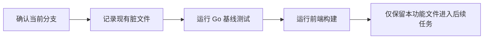
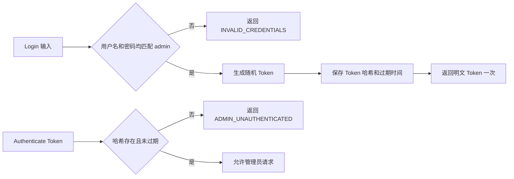
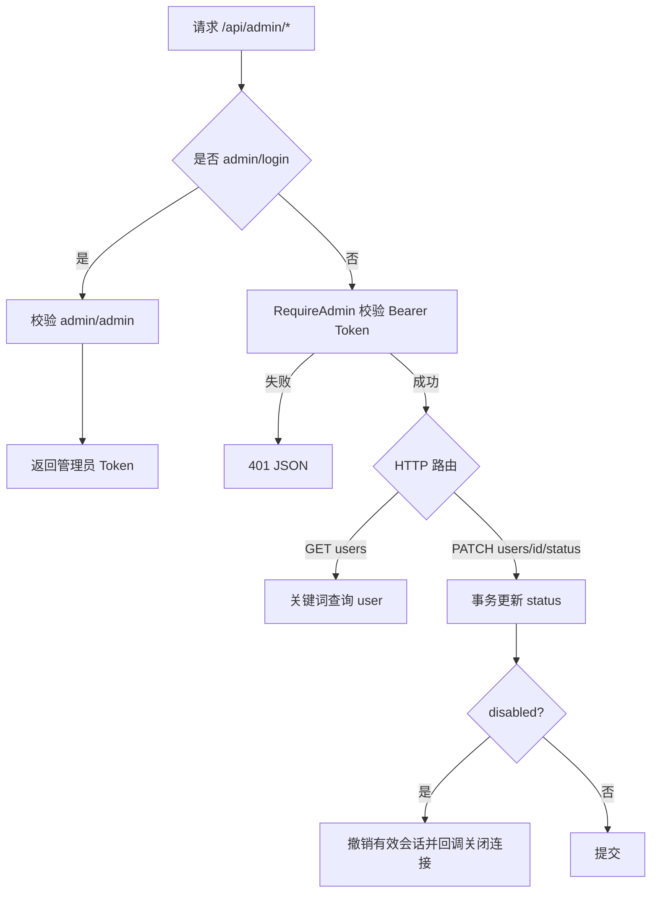
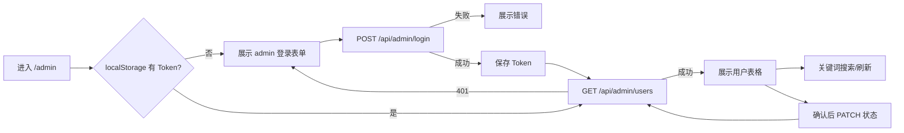

# 后台管理—用户管理一期 Implementation Plan

> **For agentic workers:** REQUIRED SUB-SKILL: Use `superpowers:executing-plans` to implement this plan task-by-task. Steps use checkbox (`- [ ]`) syntax for tracking.

**Goal:** 在现有 Vue 3 + Go HTTP 服务基础上增加一个使用 `admin/admin` 登录的轻量后台，并完成普通用户查询、搜索和启用/禁用。

**Architecture:** 后端在现有 `backend/flutter_api` 中增加独立的管理员内存会话服务和 HTTP handler。管理员 Token 不写数据库，用户管理直接复用现有 `users`、`AuthSession` 和会话撤销逻辑；前端在现有 Vue 应用中增加 `/admin` 路由和 Naive UI 页面。

**Tech Stack:** Go 1.26、GORM、SQLite、`net/http`、Go `testing`、Vue 3、Vue Router 4、Naive UI、Vite。

**Spec:** `docs/superpowers/后台管理/2026-08-31-设计.md`

## Global Constraints

- 管理员账号按当前约定固定为 `admin` / `admin`。
- 普通用户表继续使用现有 `users`，后台返回列表时只映射安全字段，不返回 `PasswordHash`、会话 Token 或设备信息。
- 用户列表通过 `keyword` 对 `phone` 和 `nickname` 做包含匹配，按 `created_at DESC` 返回全部结果；一期不增加分页参数。
- 状态变更只允许更新目标用户的 `status`，并复用现有会话撤销逻辑。
- 不做角色树、权限配置或多管理员账号。
- 不做用户删除、密码重置、批量导入导出或统计看板。
- 不改变普通用户注册、登录、单设备会话和用户数据隔离逻辑。
- 登录 Token 不写日志、不写数据库、不放入 URL；页面只保存在浏览器 `localStorage`。
- 不触碰当前工作区已有的 `data/stock.db`、`backend/data/stock.db`、T0 缓存和其他无关未跟踪文件。
- 每个任务完成自己的测试后单独提交，提交信息遵循项目现有 Conventional Commits 风格。

---

## 模块与接口

| 文件 | 职责 |
| --- | --- |
| `backend/flutter_api/admin_service.go` | 固定管理员凭据、内存 Token、用户列表和用户状态变更 |
| `backend/flutter_api/admin_service_test.go` | 管理员会话和用户管理服务的单元测试 |
| `backend/flutter_api/admin_http.go` | 管理员登录、用户列表、状态变更及管理员认证中间件 |
| `backend/flutter_api/admin_http_test.go` | 管理员 HTTP、权限和会话撤销集成测试 |
| `backend/flutter_api/auth_middleware.go` | 放行管理员登录并将管理员路径交给管理员 handler |
| `backend/flutter_api/server.go` | 挂载 `/api/admin/*`，保留已有普通 API 路由 |
| `frontend/src/components/admin.vue` | 管理员登录和用户管理页面 |
| `frontend/src/router/router.js` | 注册 `/admin` 路由 |
| `frontend/src/App.vue` | 增加后台管理导航入口 |

### 开发依赖（哪个 Task 之后出现第一个可见闭环）

Task 1 完成后可以独立验证 `admin/admin` Token 的登录与过期；Task 2 完成后出现第一个可见后端闭环（登录、查用户、改状态）；Task 3 完成后出现可点击的后台页面闭环。

### 任务 0：基线与分支

#### 流程图



#### 伪代码

```text
读取 git branch/status
运行 go test ./backend/flutter_api -count=1
运行 npm run build（workdir=frontend）
不要清理、回滚或暂存数据库、缓存和其他既有改动
```

#### 注意点

- 当前开发分支为 `feature/stragety-user`，已满足不在默认分支开发的约束；继续沿用该分支，不新建隔离分支。
- 基线失败必须记录原因，不得为了本功能顺手修改无关数据或缓存。
- 本任务不产生代码提交；只提供后续回归基线。

**Files:**

- Read: `git status`, `git log`, `backend/flutter_api`, `frontend`

**Interfaces:**

- Produces: 基线 Go 测试与前端构建结果，供后续任务比较。

- [ ] 先运行基线命令并记录结果
- [ ] 确认工作区既有数据库、缓存和未跟踪产物未被纳入变更

### 任务 1：管理员会话服务

#### 流程图



#### 伪代码

```text
NewAdminService(dao, callback) 创建 tokens map、时钟和随机 Token 生成器
Login(input):
  若 username != "admin" 或 password != "admin"，返回 401 INVALID_CREDENTIALS
  生成随机 Token，保存 hash(Token) -> now + adminSessionTTL
  返回 Token 和 expiresAt
Authenticate(rawToken):
  trim Token，查 hash(Token)
  不存在或 expiresAt <= now 时删除旧值并返回 401 ADMIN_UNAUTHENTICATED
  返回 nil
```

#### 注意点

- 在 `admin_service.go` 定义 `AdminLoginInput`、`AdminSessionResponse`、`AdminUser`、`AdminUserList` 和 `AdminService`。
- `AdminService` 保存 `dao *gorm.DB`、`sync.RWMutex`、`map[string]time.Time`、可注入 `now` 和 `newToken`，测试不能依赖真实随机值或时间。
- `AdminUser` 只包含 `ID`、`Phone`、`Nickname`、`Role`、`Status`、`CreatedAt`、`UpdatedAt`。
- 只比较固定凭据，不在数据库增加管理员记录；管理员服务重启后 Token 全部失效。
- 使用已有 `hashToken` 和 `newSecureHexToken`，不要新增 Token 格式或日志输出。
- 验证 `权限-AUTH-001`、`权限-AUTH-002`、`权限-AUTH-004`。

**Files:**

- Create: `backend/flutter_api/admin_service.go`
- Test: `backend/flutter_api/admin_service_test.go`

**Interfaces:**

- Consumes: `hashToken`, `newSecureHexToken`, `AuthError`、现有测试数据库辅助函数。
- Produces: `NewAdminService(dao *gorm.DB, onSessionsRevoked func(userID string, sessionIDs []string)) *AdminService`。
- Produces: `Login(ctx context.Context, input AdminLoginInput) (*AdminSessionResponse, error)`。
- Produces: `Authenticate(rawToken string) error`。
- Produces: `ListUsers(ctx context.Context, keyword string) (*AdminUserList, error)`。
- Produces: `UpdateUserStatus(ctx context.Context, userID, status string) (*AdminUser, error)`。

- [ ] **Step 1: Write the failing service tests**

在 `admin_service_test.go` 使用 `newTestAuthService(t).dao` 创建管理员服务，并注入固定时间、固定 Token：

```go
func TestAdminServiceLoginAcceptsFixedCredentials(t *testing.T) {
    auth := newTestAuthService(t)
    service := newTestAdminService(auth.dao)

    got, err := service.Login(context.Background(), AdminLoginInput{
        Username: "admin",
        Password: "admin",
    })
    if err != nil {
        t.Fatalf("login: %v", err)
    }
    if got.AccessToken != "admin-token" {
        t.Fatalf("token = %q, want admin-token", got.AccessToken)
    }
    if err := service.Authenticate(got.AccessToken); err != nil {
        t.Fatalf("authenticate: %v", err)
    }
}
```

补充错误用户名、错误密码和推进时钟超过 TTL 后的认证测试。

- [ ] **Step 2: Run tests to verify they fail**

Run: `go test ./backend/flutter_api -run 'TestAdminService' -count=1`

Expected: FAIL because `AdminService`、输入输出类型和方法不存在。

- [ ] **Step 3: Write the minimal implementation**

实现固定凭据与内存 Token：

```go
const adminSessionTTL = 12 * time.Hour

type AdminService struct {
    dao                *gorm.DB
    onSessionsRevoked  func(userID string, sessionIDs []string)
    mu                 sync.RWMutex
    tokens             map[string]time.Time
    now                func() time.Time
    newToken           func() (string, error)
}
```

`Login` 仅在凭据匹配后生成 Token；`Authenticate` 只接受未过期的 Token，并返回结构化的 `AuthError`。同时实现用户列表：查询 `role = user`，可选 `phone LIKE` 或 `nickname LIKE`，按 `created_at DESC` 排序，映射为 `AdminUser`。

- [ ] **Step 4: Run focused tests to verify they pass**

Run: `go test ./backend/flutter_api -run 'TestAdminService' -count=1`

Expected: PASS，固定凭据、错误凭据、过期 Token 和用户查询均通过。

- [ ] **Step 5: Commit**

```bash
git add backend/flutter_api/admin_service.go backend/flutter_api/admin_service_test.go
git commit -m "feat(admin): add administrator session service"
```

### 任务 2：管理员用户管理 API 与路由

#### 流程图



#### 伪代码

```text
RequireAdmin:
  OPTIONS 直接交给 next
  从 Authorization 提取 Bearer Token
  service.Authenticate 失败则写 401
  成功则调用 next

GET /api/admin/users:
  keyword := query.keyword
  service.ListUsers(ctx, keyword)
  返回 {items, total}

PATCH /api/admin/users/{id}/status:
  只接受 JSON {status: "active"|"disabled"}
  transaction:
    查 role=user 的目标用户
    更新 status
    disabled 时调用 revokeActiveSessionsTx(..., "admin_disabled")
  提交后回调被撤销的会话
  返回安全用户对象
```

#### 注意点

- `admin_http.go` 定义 `RequireAdmin`、`NewAdminHTTPHandler` 和 `WriteAdminError`，复用现有 `bearerTokenFromRequest`、`WriteJSON`、`WriteJSONStatus`。
- `POST /api/admin/login` 公开；其他管理员路径由 `RequireAdmin` 保护。修改 `auth_middleware.go` 的 `publicPaths` 和 `isProtectedPath`，让普通认证中间件不吞掉管理员路径。
- `newHTTPHandler` 创建一个 `AdminService`，挂载 `/api/admin/`，并通过回调调用已有 `closeWebSocketsForSessions`。
- 用户状态更新必须在事务内完成；禁用时用已有 `revokeActiveSessionsTx`，撤销原因固定为 `admin_disabled`。更新普通用户时不影响其他用户。
- 错误码固定：凭据错误 `INVALID_CREDENTIALS`，管理员 Token 无效 `ADMIN_UNAUTHENTICATED`，非法状态 `INVALID_ARGUMENT`，用户不存在 `USER_NOT_FOUND`。
- 验证 `权限-AUTH-003`、`用户-USER-001` 至 `用户-USER-006`。

**Files:**

- Create: `backend/flutter_api/admin_http.go`
- Test: `backend/flutter_api/admin_http_test.go`
- Modify: `backend/flutter_api/auth_middleware.go`
- Modify: `backend/flutter_api/server.go`

**Interfaces:**

- Consumes: Task 1 的 `AdminService`、`AdminUserList`、`UpdateUserStatus`。
- Produces: `RequireAdmin(service *AdminService, next http.Handler) http.Handler`。
- Produces: `NewAdminHTTPHandler(service *AdminService) http.Handler`。
- Produces: `POST /api/admin/login`、`GET /api/admin/users`、`PATCH /api/admin/users/{id}/status`。

- [ ] **Step 1: Write the failing HTTP tests**

在 `admin_http_test.go` 通过 `newHTTPHandler(authService)` 验证真实路由：

```go
func TestAdminHTTPListsUsersAndFiltersKeyword(t *testing.T) {
    auth := newTestAuthService(t)
    handler := newHTTPHandler(auth.AuthService)

    createUserForAdminTest(t, auth, "13800000000", "Alice")
    createUserForAdminTest(t, auth, "13900000000", "Bob")
    token := loginAdminForTest(t, handler)

    req := httptest.NewRequest(http.MethodGet, "/api/admin/users?keyword=Alice", nil)
    req.Header.Set("Authorization", "Bearer "+token)
    rec := httptest.NewRecorder()
    handler.ServeHTTP(rec, req)

    if rec.Code != http.StatusOK {
        t.Fatalf("status = %d, body = %s", rec.Code, rec.Body.String())
    }
    if !strings.Contains(rec.Body.String(), "Alice") || strings.Contains(rec.Body.String(), "Bob") {
        t.Fatalf("body = %s, want only Alice", rec.Body.String())
    }
    if strings.Contains(rec.Body.String(), "passwordHash") || strings.Contains(rec.Body.String(), "deviceId") {
        t.Fatalf("body contains private fields: %s", rec.Body.String())
    }
}
```

补充无 Token/普通 Token、禁用后原会话失效、重新启用后可登录、不存在用户和非法状态测试。

- [ ] **Step 2: Run tests to verify they fail**

Run: `go test ./backend/flutter_api -run 'TestAdminHTTP|TestAdmin' -count=1`

Expected: FAIL because管理员 handler、路由和权限包装不存在。

- [ ] **Step 3: Write the minimal implementation**

先实现管理员 HTTP handler 和中间件，再在 `server.go` 中挂载：

```go
mux.Handle("/api/admin/", NewAdminHTTPHandler(NewAdminService(
    authService.dao,
    func(userID string, sessionIDs []string) {
        closeWebSocketsForSessions(userID, sessionIDs)
    },
)))
```

`auth_middleware.go` 对 `/api/admin/login` 和 `/api/admin/` 返回“不由普通认证处理”；管理员 handler 内部只放行登录接口，其余请求统一走 `RequireAdmin`。所有 JSON 错误先写状态码再写响应体。

- [ ] **Step 4: Run focused and package regression tests**

Run: `go test ./backend/flutter_api -run 'TestAdminHTTP|TestAdmin' -count=1`

Expected: PASS，管理员接口、普通用户权限边界、状态变更和会话撤销通过。

Run: `go test ./backend/flutter_api -count=1`

Expected: PASS，现有认证、用户数据和 WebSocket 相关测试无新增失败。

- [ ] **Step 5: Commit**

```bash
git add backend/flutter_api/admin_http.go backend/flutter_api/admin_http_test.go backend/flutter_api/auth_middleware.go backend/flutter_api/server.go
git commit -m "feat(admin): add user management api"
```

### 任务 3：Vue 后台登录和用户管理页面

#### 流程图



#### 伪代码

```text
组件初始化:
  token = localStorage.adminAccessToken
  若 token 非空，loadUsers；否则显示登录

login:
  POST localhost:8080/api/admin/login {username, password}
  成功保存 token 并 loadUsers

loadUsers:
  GET localhost:8080/api/admin/users?keyword=keyword
  401 清理 token 并回登录页
  成功更新 tableData 和 total

toggleStatus(row):
  弹确认框
  确认后 PATCH /api/admin/users/{row.id}/status
  成功提示并 loadUsers
```

#### 注意点

- `admin.vue` 使用现有 `n-card`、`n-form`、`n-data-table`、`n-tag`、`n-button` 和 `useMessage/useDialog`，不引入新组件库或状态管理。
- 账号和密码初始值均为 `admin`，仅 Token 写入 `localStorage.adminAccessToken`，不保存密码。
- 发送请求时使用 `Authorization: Bearer <token>`；管理员接口 401 时清理 Token，避免页面停留在失效列表。
- 路由只注册 `/admin`；在 `App.vue` 的现有水平菜单增加“后台管理”入口，页面视觉继续复用全局主题。
- 页面构建使用项目已有 `npm run build`，手工验收覆盖 `页面-UI-001` 至 `页面-UI-005`。

**Files:**

- Create: `frontend/src/components/admin.vue`
- Modify: `frontend/src/router/router.js`
- Modify: `frontend/src/App.vue`
- Modify: `frontend/package.json`（补齐现有 `main.js` 已使用的 `tdesign-vue-next@1.20.7` 直接依赖）

**Interfaces:**

- Consumes: Task 2 的管理员 API。
- Produces: Vue route `{ path: '/admin', component: adminView, name: 'admin' }`。
- Produces: 管理员登录、用户查询、关键词过滤、状态确认变更和失效 Token 回登录。

- [ ] **Step 1: Write the failing page verification**

在页面文件和路由尚不存在时执行：

```bash
npm run build
```

并在开发服务器中访问 `#/admin`，确认当前没有后台路由页面；这一步记录为页面闭环缺失的基线。页面行为依照测试契约进行手工记录，不额外引入前端测试依赖。

- [ ] **Step 2: Implement the minimal page**

创建 `admin.vue`，保留单文件组件边界：登录态、请求、列表和状态操作只服务于后台用户管理；不要抽取通用后台框架。实现路由和菜单入口，列表列只包含设计规定的安全字段。

若构建前发现 `main.js` 的既有 `tdesign-vue-next/es/style/index.css` 无法解析，使用锁文件已存在的 `tdesign-vue-next@1.20.7` 补齐 `frontend/package.json` 直接开发依赖，不升级其他包。

- [ ] **Step 3: Run build and manual acceptance**

Run: `npm run build`（workdir: `frontend`）

Expected: PASS，Vue 编译无错误。

手工验证：

1. 打开 `#/admin`，页面展示 `admin/admin` 表单。
2. 使用错误密码，仍停留登录页并显示错误。
3. 使用 `admin/admin`，表格出现用户列表。
4. 输入账号或昵称关键词，点击查询，列表只保留匹配项。
5. 点击启用/禁用，确认后状态刷新；取消确认不发状态请求。
6. 清理 `localStorage.adminAccessToken` 或改成无效值，刷新后回到登录页。

- [ ] **Step 4: Run full relevant regression**

Run: `go test ./backend/flutter_api -count=1`

Expected: PASS。

Run: `npm run build`（workdir: `frontend`）

Expected: PASS。

- [ ] **Step 5: Commit**

```bash
git add frontend/src/components/admin.vue frontend/src/router/router.js frontend/src/App.vue
git commit -m "feat(admin): add user management page"
```

## 完成前核对

- [ ] 对照设计逐项确认登录、列表、搜索、启用/禁用和权限边界。
- [ ] `go test ./backend/flutter_api -count=1` 通过。
- [ ] `npm run build` 通过。
- [ ] `git diff --check` 通过。
- [ ] 变更列表不包含 `data/stock.db`、`backend/data/stock.db`、T0 缓存或其他无关文件。
